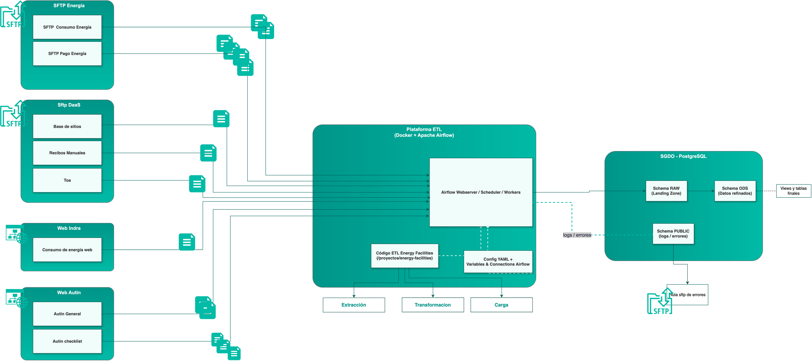

<h1 align="center">
  Scraper Integratel
</h1>

<p align="center">
  <strong>Stack de Apache Airflow para ETL offline en servidores Linux</strong>
</p>

<p align="center">
  
  
  
  
  
  
  
  
</p>

---

## 🏗️ Arquitectura



---

## 📑 Índice

1. [Instalación de Docker CE (Requisito previo)](#instalación-de-docker-ce-requisito-previo)
2. [Generar paquete offline (Dev)](#generar-paquete-offline-dev)
3. [Despliegue offline en el servidor](#despliegue-offline-en-el-servidor-linux-amd64)
4. [Configuración y credenciales](#configuración-y-credenciales)
5. [Notas de operación](#notas-de-operación)
6. [DAGs y Schedules](#dags-y-schedules)
7. [Herramientas de desarrollo](#herramientas-de-desarrollo)
8. [Documentación adicional](#documentación-adicional)

---

<br>

## 🐳 Instalación de Docker CE (Requisito previo)

Si el servidor no tiene Docker instalado, consulta la guía completa en **[docs/DOCKER_INSTALL.md](docs/DOCKER_INSTALL.md)**.

---

<br>

## 📦 Generar paquete offline (Dev)

Este paso se realiza en una máquina de desarrollo con acceso a Internet. Para la guía completa ver **[docs/DEPLOYMENT.md](docs/DEPLOYMENT.md)**.

**Resumen rápido:**

```bash
./generar_paquete_offline.sh
```

Esto genera `scraper-integratel-offline.tar.gz` con todas las imágenes Docker necesarias.

---

<br>

## 🚀 Despliegue offline en el servidor (Linux `amd64`)

1. **Copiar imagen tar.gz via sftp a la raiz del directorio**
   ```
   scraper-integratel-offline.tar.gz
   ```

2. **Copiar repositorio completo al servidor**
   Asegúrate de tener el repositorio completo en el servidor con todas las carpetas necesarias.

3. **Importar imágenes sin Internet**
   ```bash
   cd /daas1/analytics
   sudo sh -c "gunzip -c $(pwd)/scraper-integratel-offline.tar.gz | docker load"
   sudo docker images | grep -E 'scraper-integratel|postgres|redis|prom'
   ```
4. **Revisar configuración del proyecto**
   - Crear directorios necesarios:
     ```bash
     mkdir -p ./dags ./logs ./plugins ./config ./monitoring ./proyectos
     ```
   - Crear archivo `.env` con la configuración básica:
     ```bash
     echo -e "AIRFLOW_UID=$(id -u)" > .env
     echo -e "LOG_LEVEL=INFO" >> .env
     ```
5. **Llenar cada carpeta con los contenidos necesarios**
   - `docker-compose.yml`: Debe estar en la raíz del repositorio.
   - `dags/`: Coloca los DAGs que quieras habilitar (si no hay ninguno, deja la carpeta vacía).
   - `proyectos/`: Debe contener todo el codigo base necesario para correr los DAGs (imprescindible para que los DAGs funcionen).
   - `plugins/`: Debe contener plugins personalizados de Airflow (**debe contener `custom_metrics.py` para usar métricas**).
   - `monitoring/`: Debe contener `statsd-mapping.yml` y `prometheus.yml` para el sistema de métricas.

6. **Levantar la plataforma**
   ```bash
   cd /daas1/analytics
   sudo docker compose up -d --pull never
   ```
7. **Verificar servicios**
   ```bash
   curl http://IP_DE_SERVIDOR:9095/api/v2/version
   ```
   Si la red corporativa bloquea el puerto 9095, crea un túnel: `ssh -L 9095:localhost:9095 usuario@servidor`.

8. **Acceso y operaciones**
   - UI de Airflow: `http://<host>:9095` (usuario/clave por defecto: `airflow` / `airflow`).
   - Logs: `sudo docker compose logs -f airflow-worker`.
   - Detener servicios: `sudo docker compose down` (usa `-v` si deseas borrar volúmenes).

### Importar Connections desde JSON

1. **Colocar el archivo JSON**
   ```bash
   # Copiar el archivo a:
   /daas1/analytics/config/connections_{env}.json
   ```

2. **Importar en Airflow**
   ```bash
   cd /daas1/analytics
   sudo docker compose exec airflow-apiserver airflow connections import /opt/airflow/config/connections_{env}.json
   ```

3. **Verificar**
   ```bash
   sudo docker compose exec airflow-apiserver airflow connections list
   ```

> **Nota:** Si una connection ya existe, primero elimínala:
> ```bash
> sudo docker compose exec airflow-apiserver airflow connections delete NOMBRE_CONNECTION
> ```

---

<br>

## ⚙️ Configuración y credenciales

### Variables obligatorias

Estas variables **deben configurarse** en Airflow antes de ejecutar cualquier DAG:

| Variable | Descripción | Valores |
|----------|-------------|---------|
| `ENV_MODE` | Entorno actual | `dev`, `staging`, `prod` |
| `LOGGING_LEVEL` | Nivel de logging | `INFO`, `DEBUG`, `WARNING`, `ERROR` |

Para configurarlas en Airflow UI: **Admin > Variables > +**

El sistema carga configuración con prioridad: `Airflow Variables > Airflow Connections > YAML > Variables de entorno`

Para más detalles ver **[docs/CONFIGURACION.md](docs/CONFIGURACION.md)**.

---

<br>

## 📝 Notas de operación

- Ejecuta `AIRFLOW_UID=$(id -u)` antes de `docker compose up` si levantas el stack en otra máquina Linux.
- Para usar Docker sin `sudo`, añade tu usuario al grupo `docker` y vuelve a iniciar sesión.
- Los logs en vivo están disponibles con `sudo docker compose logs -f`.
- Si necesitas reconstruir la imagen, vuelve a ejecutar `./generar_paquete_offline.sh` y distribuye el nuevo bundle.

---

<br>

## 📋 DAGs y Schedules

Para la lista completa de DAGs, schedules y stored procedures ver **[docs/DAGS.md](docs/DAGS.md)**.

---

<br>

## 🛠️ Herramientas de desarrollo

### sync_sftp.py

Script para sincronizar archivos locales con servidores SFTP. Para la guía completa ver **[docs/SYNC_SFTP.md](docs/SYNC_SFTP.md)**.

**Uso rápido:**
```bash
python sync_sftp.py --dry-run  # Ver qué se sincronizaría
python sync_sftp.py            # Sincronizar
```

---

<br>

## 📚 Documentación adicional

| Documento | Descripción |
|-----------|-------------|
| [docs/CONFIGURACION.md](docs/CONFIGURACION.md) | Variables, Connections y sistema de configuración |
| [docs/DAGS.md](docs/DAGS.md) | DAGs, schedules y stored procedures |
| [docs/SYNC_SFTP.md](docs/SYNC_SFTP.md) | Herramienta de sincronización SFTP |
| [docs/DEPLOYMENT.md](docs/DEPLOYMENT.md) | Generar paquete offline (Dev) |
| [docs/DOCKER_INSTALL.md](docs/DOCKER_INSTALL.md) | Instalación de Docker CE |
| [docs/TABLAS_FINALES_INGESTAS.md](docs/TABLAS_FINALES_INGESTAS.md) | Tablas RAW/ODS por ingesta |
| [proyectos/energiafacilities/README.md](proyectos/energiafacilities/README.md) | Framework y módulos de extracción |
